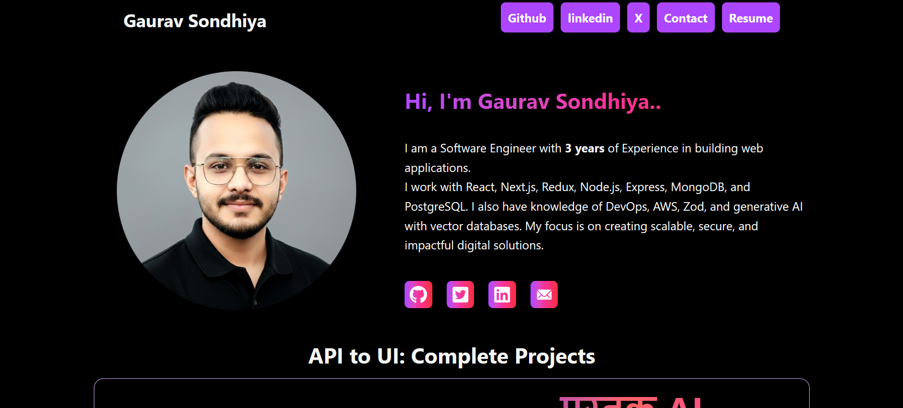

🌐 Portfolio Website

I’ve built my fully responsive portfolio website to showcase my projects, experience, and technical skills.
It’s developed using React.js, Tailwind CSS, and follows a modern, mobile-first design.

🧠 Highlights:

Fully responsive design (works perfectly on all screen sizes)

Showcases my professional experience and projects

Smooth animations and clean UI

Built with reusable components and optimized performance

🔗 Live Demo: https://gauravsondhiya.netlify.app/
💻 Repository: https://github.com/gauravsondhiya/Portfolio

